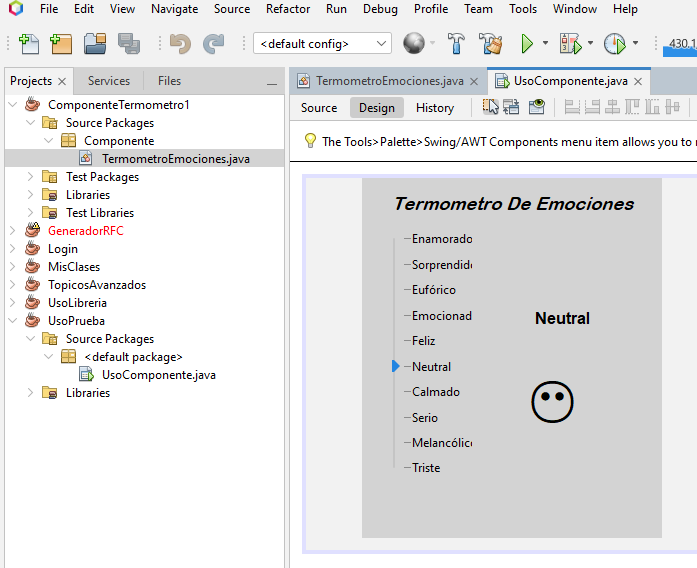
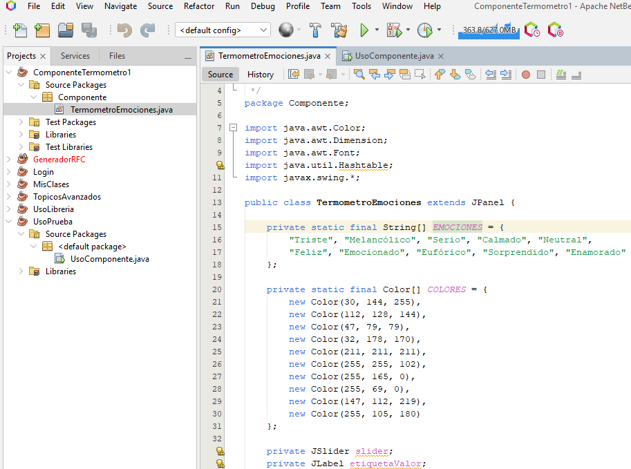
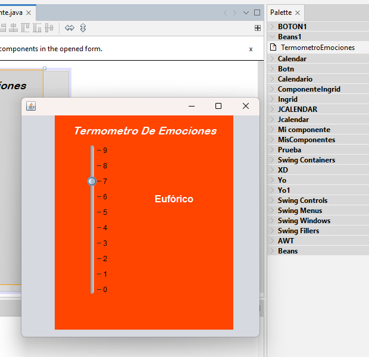
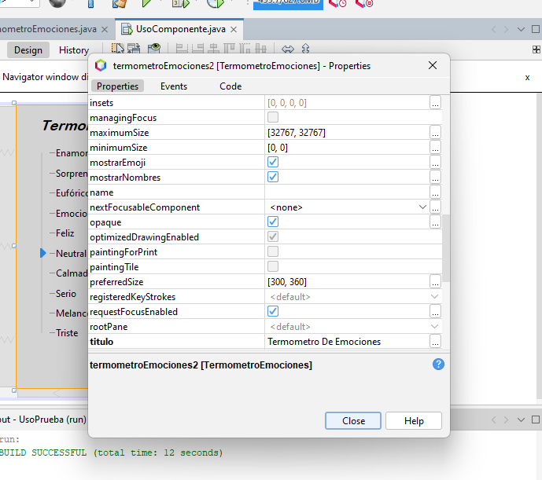
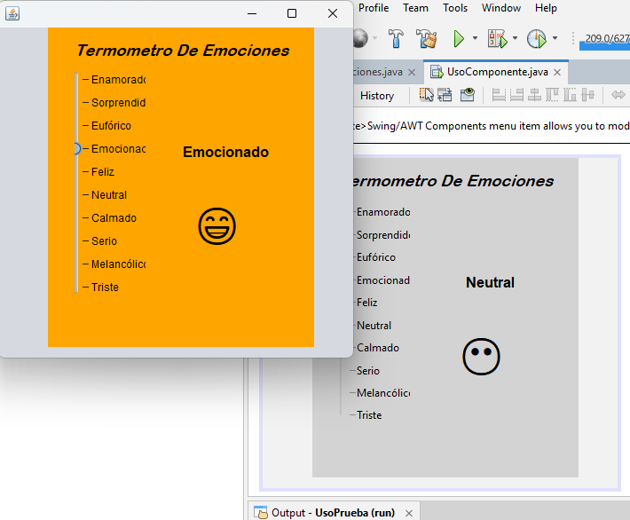

# 🌡️ Termómetro de Emociones

[](https://www.oracle.com/java/)  
[](https://netbeans.apache.org/)  
[](LICENSE)  

Un componente visual en **Java Swing** que representa estados emocionales de forma interactiva mediante un control deslizante (JSlider), cambios de color y emojis. Diseñado para integrarse fácilmente en aplicaciones Java, ideal para proyectos educativos, de bienestar o cualquier software con una interfaz amigable.  

---

## 📸 Vista previa

<p align="center">
  
</p>

---

## 📂 Estructura del repositorio

```
📁 jar/                  → Archivo .jar compilado para importar en otros proyectos
📁 componente/           → Código fuente completo del componente (proyecto NetBeans)
📁 UsoComponente/        → Proyecto de ejemplo que implementa el componente
📁 imagenes/             → Capturas de pantalla para la documentación
📄 LICENSE               → Licencia MIT
📄 README.md             → Archivo de documentación
```

---

## ✨ Características

- 🎨 **Cambio dinámico de colores:** el fondo cambia según la emoción seleccionada.
- 😀 **Emojis integrados:** cada emoción tiene un emoji representativo.
- 🏷️ **Lista de emociones personalizable:** incluye 10 emociones predefinidas.
- 🛠️ **Atributos configurables:** cambia el título, muestra/oculta nombres y emojis.
- 📦 **Fácil integración:** usa el archivo `.jar` para agregar el componente a tus proyectos.

---

## 📋 Requisitos

- **Java** 1.8 o superior  
- **NetBeans IDE** 12 o más reciente (o cualquier IDE compatible con Swing)  
- Sistema operativo: Windows, macOS o Linux  

---

## 🚀 Instalación y uso

### 1️⃣ Clonar el repositorio
```bash
git clone https://github.com/TU_USUARIO/TU_REPOSITORIO.git
```

### 2️⃣ Importar el componente a NetBeans

1. Abre **NetBeans**.  
2. Ve a `Tools > Palette > Swing/AWT Components > Add from JAR`.  
3. Selecciona `TermometroEmociones.jar` desde la carpeta `/jar`.  
4. Agrega el componente a una categoría personalizada de la paleta.  

### 3️⃣ Usar el componente en tu aplicación

1. Crea o abre un proyecto Java Swing.  
2. Abre el diseñador de formularios (JFrame).  
3. Desde la paleta Swing, arrastra el **Termómetro de Emociones** al formulario.  
4. Configura sus propiedades desde la ventana de propiedades.  

---

## 🛠️ Métodos destacados

| Método                              | Descripción                                                      |
|-------------------------------------|------------------------------------------------------------------|
| `setTitulo(String titulo)`          | Cambia el título mostrado en la parte superior del componente.  |
| `setMostrarEmoji(boolean mostrar)`  | Habilita o deshabilita la visualización de emojis.              |
| `setMostrarNombres(boolean mostrar)`| Muestra u oculta las etiquetas de nombres en el slider.         |

---

## 🖥️ Ejemplo de uso

```java
import Componente.TermometroEmociones;

public class Main {
    public static void main(String[] args) {
        javax.swing.JFrame frame = new javax.swing.JFrame("Demo");
        TermometroEmociones termometro = new TermometroEmociones();
        termometro.setTitulo("Estado Emocional");
        termometro.setMostrarEmoji(true);
        termometro.setMostrarNombres(true);

        frame.add(termometro);
        frame.setSize(400, 500);
        frame.setVisible(true);
        frame.setDefaultCloseOperation(javax.swing.JFrame.EXIT_ON_CLOSE);
    }
}
```

---

## 👩‍💻 Créditos

- 👩‍🎨 **Ingrid Arcadio Aparicio**  
- 👩‍🎨 **Xana Amalinalli Pérez Giménez**

---

## 📜 Licencia

Este proyecto está licenciado bajo los términos de la **MIT License**. Consulta el archivo [LICENSE](LICENSE) para más detalles.  

---
## 📸 Vista previa

<p align="center">
  
</p>

---

## 📸 Otras capturas

| Código fuente                              | Ejecución del componente                      |
|---------------------------------------------|------------------------------------------------|
|               |            |

| Propiedades en NetBeans                     | Uso dentro de un JFrame                        |
|----------------------------------------------|-------------------------------------------------|
|      |                         |

---

# 🚀 ¡Listo para usar!
Integra el **Termómetro de Emociones** en tus proyectos Java y dale un toque visual atractivo e interactivo. 🌈
